<h1 align="center">
<a href="https://shoreenb.github.io/bitcoin-basics/" target="_blank">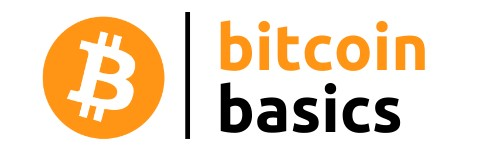</a>
</h1>
<h2>
[An introduction to Bitcoin for beginners](https://shoreenb.github.io/bitcoin-basics/)
</h2>

[Bitcoin Basics] is an informative website, devised for those who want to learn about this new (and often overwhelming) technology. Features include: a beginners guide demystifying Bitcoin,  current market rates and a clean, minimalist design that enables a newcomer to easily navigate the pages.

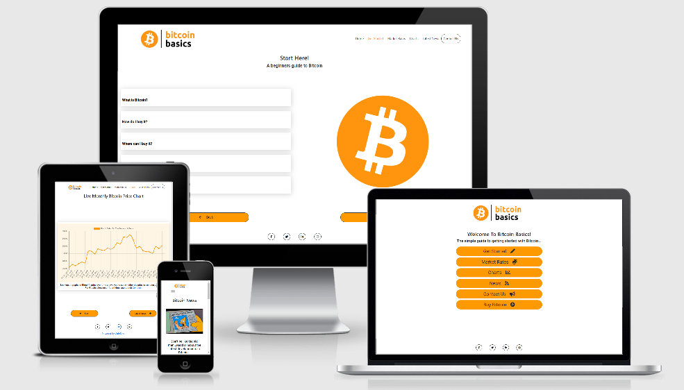

[Visit the Bitcoin Basics page](https://shoreenb.github.io/bitcoin-basics/)

## Table of Contents

1. [UX](#ux)

   - [**Project Goals**](#project)
   - [**Visitor Goals**](#visitor)
   - [**Developer Goals**](#developer)
   - [**User Stories**](#user)
   - [**Design**](#design)
   - [**Wireframes**](#wireframes)

2. [**Features**](#features)

   - [**Existing Features**](#existing)
   - [**Features Left To Implement**](#featuresLeft)

3. [**Technologies Used**](#technologies)

4. [**Testing**](#testing)

5. [**Deployment**](#deploy)

   - [**GitHub Pages**](#githubpages)
   - [**How to run this project locally**](#local)

6. [**Credits**](#credits)

   - [**Content**](#content)
   - [**Media**](#media)
   - [**Code**](#code)
   - [**Acknowledgements**](#acknowledge)

## UX

### Project Goals

The main goal of Bitcoin Basic is to provide information about Bitcoin that is easy to understand, so that a newcomer will leave the site with a solid foundational knowledge of what Bitcoin is, it's current rate and where they can find more in depth information if they want to learn more. It will be a fully responsive website, with a minimalist design and a logical easy to follow structure.

#### Visitor Goals

The target audience for this website is a user that is not necessarily technical, who has recently heard about Bitcoin and wants:

- To know more about what it is and how to start using it.
- To know the initial steps to take when first using bitcoin.
- Clear visuals that don't confuse or overwhelm the visitor.
- Intuitive page layout and navigation.
- To know where they can find further reading and more in-depth information.
- To see the current market rates of Bitcoin against various currencies.
- To see current news on Bitcoin.

#### Developer Goals

As a developer the aim is to create a web application that will:

- Enable a visitor to find the answers to most of the questions a newcomer to Bitcoin will have.
- Be responsive, interactive and dynamic using HTML, CSS, JavaScript and where necessary jQuery and/or API's in design, development and implementation.
- Be a great addition to the portfolio.

#### User Stories

As a newcomer to Bitcoin, with little to no technical knowledge, I want:

1. A clear guide with the key information I need to understand what Bitcoin is.
2. Clear navigation to easily maneuver through the site.
3. The ability to compare the value of Bitcoin to various fiat currencies.
4. To see the current price of Bitcoin.
5. To be able to see the latest news to give context about Bitcoin.
6. To have the ability to send the questions I have about Bitcoin.

As someone who has more knowledge about Bitcoin, I want:

1. The ability to go directly to the information that I require about the current price of Bitcoin.
2. Information on further/ more advanced information on Bitcoin.
3. A resource that I can direct new enquirers about Bitcoin to.
4. To see the latest developments in Bitcoin.
5. The ability to provide feedback about further improvements that can be made on the site to meet needs as an invested Bitcoin follower.

#### Design

Bitcoin can easily become overwhelming to a newcomer who may not have looked at the financial market before, let alone cryptocurrency! Keeping that in mind the design choices have been made to interfere as little as possible with the main subject matter.

##### Colours

The main colours used in this project for the logo, buttons and font was the main colour of the Bitcoin Logo: rgb(255, 153, 0);

This contrasted well against black and white and added enough interest to the design without making it too distracting.

##### Font

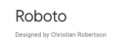

The font chosen was Roboto because it has a clean, modern type that would go well with the minimalist theme.

##### Icons

The icons used on the landing page were chosen to emphasise meaning and make it obvious, at a glance, where that navigation button leads to.

##### Styles

As there are only a few elements on each page, the hover effect on the buttons directed the visitor to it's function but also added dynamism.

#### Wireframes

The following wireframes were created on the skeleton plane as part of the planning process of the project using [Balsamiq](https://balsamiq.com/)

- [Home Page](assets/images/wireframes/landing-page.pdf)
- [Get Started Page](assets/images/wireframes/getting-started.pdf)
- [Market Rates Page](assets/images/wireframes/market-rates.pdf)
- [News Page](assets/images/wireframes/news.pdf)
- [Contact Form](assets/images/wireframes/email-form.pdf)

## Features

#### Existing Features

1. ##### Home Page

   - On arrival at the site, the visitor will see a group of 6 navigation buttons, which are in place of the navbar. The width of the buttons are responsive, and will adapt to the screen size you are using. 
    
    

   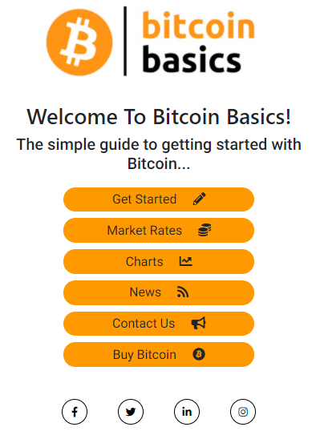
    

   - From the home page you can choose to go to the beginners guide or directly check the market price, monthly Bitcoin chart, the latest news or go to an exchange to buy Bitcoin if you are not a beginner.

2. ##### A guide on how to get started with Bitcoin

   - The accordion component allows the information in the guide to be displayed whilst keeping the layout clutter free.

    

     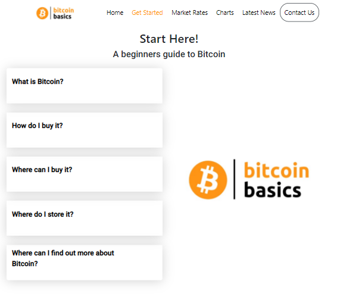
    

   - This feature also allows the visitor to go straight to a particular part of the guide rather than being forced to read it all.

   - The background colour of the open section makes it clear that section is open.

    

     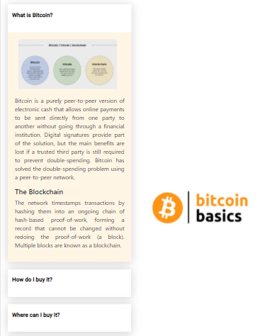
    

3. ##### Interactive table of market rates

   - Using [CoinDesk API](https://www.coindesk.com/price/bitcoin) visitors can select checkboxes next to their required currencies and display those current rates in a table. 

    

     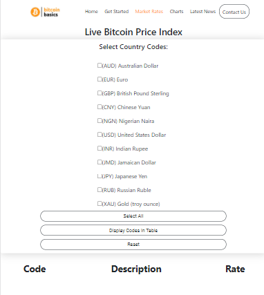
    

   - They can also click the 'Select All' button to display all currency rates in the table

    

     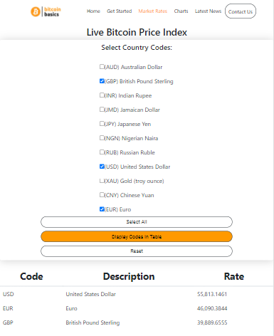
    

   - This feature gives the visitor complete control over the range of information they want to view

4. ##### Updating chart of Bitcoin from the past month

   - Using [CoinDesk API](https://www.coindesk.com/price/bitcoin) visitors can see an updating chart of the last 31 days of the price of Bitcoin.

   - This allows them to easily see how Bitcoin is trending and its current price as it relates to the price on a particular day in the last month.

   - As this chart is updating daily, it remains a useful resource that visitors can come back to.

    

     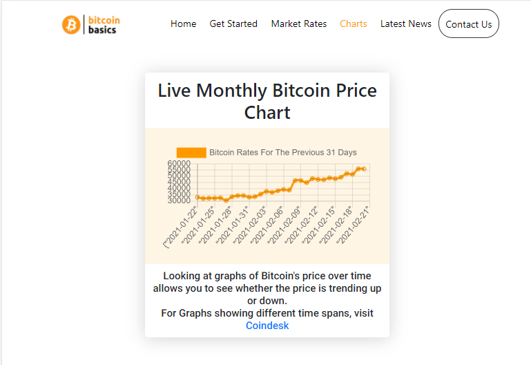
    

5. ##### Updating Bitcoin news articles

   - Using [Messari.io API](https://messari.io/) visitors can click the title links to see the current news articles for Bitcoin.

   - The articles are updating regularly, which gives visitors a reason to return to the site.

    

     
    

6. ##### Email success/error modal

   - The visitor has the ability to send an email message in the contact form, which needs to meet validation requirements before it can be sent.

   - If the form is filled out incorrectly, feedback is given in an error modal so that the visitor can amend the details.

    

     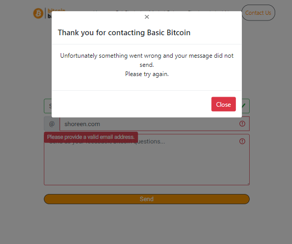
    

   - When the email has been sent successfully, feedback is given in a success modal so that the visitor knows that the message was sent.

    

     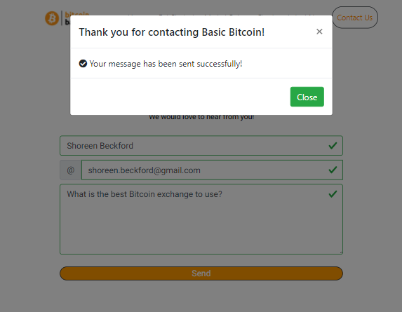
    

#### Features Left To Implement

1. ##### Calculator
   - Currently the Market Rates page shows the current price of 1 Bitcoin in a particular currency. In future a calculator feature that would allow visitors to see the price of any amount of Bitcoin in their chosen currency would be a useful tool. For example, a visitor could find out how much $50 is worth in Bitcoin and what the price of 3 Bitcoin is in Dollars.

2. ##### Current price of Bitcoin on every page
   - It would be useful for visitors to be able to instantly see the current price of Bitcoin on every page, rather than having to go to the Market Rates page. 

3. ##### Charts of different time spans
   - Having the ability to see how the price of Bitcoin has changed over a range of time spans i.e. 24 hours, 7 days, 1 year would give the visitor a more informed view of Bitcoin overall. 

4. ##### More detailed instructions on how to buy Bitcoin
   - Buying Bitcoin can be intimidating for a beginner so having step by step instructions on buying bitcoin would be a very useful tool to implement in future, that a person can refer back to if they are unsure at any point during the buying process.

## Technologies Used

This project utilises HTML, CSS and JavaScript programming languages.

- [JQuery](https://jquery.com/) 
  - This project used **JQuery** for DOM manipulation and Event Handling.
- [Gitpod](https://www.gitpod.io/)
  - The project was created and developed using the open sourced platform **Gitpod**.
- [GitHub](https://github.com/)
  - This project used **GitHub** allow access to the project code and store the project remotely.
- [Google Fonts](https://fonts.google.com/)
  - **Google Fonts** was used to style the fonts for the project.
- [Bootstrap](https://getbootstrap.com/)
  - **Bootstrap** was used for its CSS Framework to easily develop a responsive project using its simplified structure.
- [Font Awesome](https://fontawesome.com/)
  - The icons used for this project are provided by **Font Awesome**.
- [AutoPrefixer](https://autoprefixer.github.io/)
  - This project used **AutoPrefixer** to ensure that all the CSS prefixes were the most current version.

## Testing

Details on Testing can be found in the separate [testing.md](testing.md) file

## Deployment

This project was developed using [Gitpod](https://www.gitpod.io/) and pushed to [GitHub](https://github.com/)

#### GitHub Pages

To deploy Bitcoin Basics to [GitHub Pages](https://pages.github.com/). The procedure is outlined below:

1. Go to [Github](https://github.com/) and log in.
2. From the repositories listed on the left-hand side, click on [shoreenb/bitcoin-basics.](https://github.com/shoreenb/bitcoin-basics)
3. Underneath the repository name are some headings: Code, Issues, Pull requests, Actions, Projects, Wiki, Security, Insights and Settings.
   Click on **Settings.**
4. Scroll down until you see the heading **'GitHub Pages'**
5. Under **Source** is a dropdown menu called 'Branch:', click on it and select **'master'**.
6. The page will then automatically reload and when you scroll back down to the **GitHub Pages** section you will see the link of your published page 
displayed above the Source title.
7. It may take a few minutes for the background of the link to turn green, but once it does, your site is published and you will be able to open it.

### Forking The GitHub Repository

Forking the GitHub Repository makes a copy of the original repository so that you can view and/or make changes without affecting the original
repository. To do this:

1. Go to [Github](https://github.com/) and log in.
2. Locate a repository - follow this link for the [Bitcoin Basics Repository](https://github.com/shoreenb/bitcoin-basics))
3. Above the "Settings" Button on the menu, on the right-hand side locate the "Fork" Button. It is next to the 'star' button.
4. You should now have a copy of the original repository in your GitHub account.

#### How to run this project locally

To clone Bitcoin Basics from GitHub:

1. Go to [Github](https://github.com/) and log in.
2. Locate the repository - follow this link for the [Bitcoin Basics Repository](https://github.com/shoreenb/bitcoin-basics)
3. Under the repository name, click the green "Clone or download" button.
4. To clone the repository using HTTPS, copy the link under "Clone with HTTPS".
5. Open a terminal and if you need to, change the current working directory to the location where you want the cloned directory to be made.
6. Type `git clone`, and then paste the URL you copied in Step 3 on GitHub.

`$ git clone https://github.com/YOUR-USERNAME/YOUR-REPOSITORY`

7. When you press Enter your local clone will be created.

Further information and troubleshooting on cloning a repository from Github can be found on [GitHub Docs](https://docs.github.com/en/github/creating-cloning-and-archiving-repositories/cloning-a-repository)

## Credits

### Content

All of the text written in this project has been written by the developer. 

Information for the Get Started guide on Bitcoin obtained from:
- The original [Bitcoin white-paper](https://bitcoin.org/bitcoin.pdf)
- [Bitcoin.com](https://www.bitcoin.com/get-started/a-quick-introduction-to-bitcoin/)
- [Andreas M. Antonopoulos](https://aantonop.com/workshops/introduction-to-bitcoin-and-open-blockchains/)
- [CoinFloor](https://coinfloor.co.uk/)

#### Media

##### Images
- The Bitcoin Basics logo was created using [Canva](https://www.canva.com/)
- The Bitcoin image used throughout the project was from [Logos-Marcas](https://logos-marcas.com/bitcoin-logo/) and [WikimediaImages](https://pixabay.com/users/wikimediaimages-1185597/) 
- The image used in the 'What is Bitcoin' in the Get Started guide was sourced from 
- The images for 'The Internet of Money' books were also sourced from [Andreas M. Antonopoulos](https://aantonop.com/books/)
- The Bitcoin Standard book image was obtained from [Saifedean Ammous](https://saifedean.com/)
- The image of the old man yelling at bitcoin was sourced from [Money Morning](https://www.moneymorning.com.au/20180126/tiny-region-now-crypto-leader.html)

#### Code
The API's used in this project were:
- [CoinDesk](https://www.coindesk.com/price/bitcoin) used for the current market rates and the data in the chart of the price of Bitcoin over the last 31 days.
- [Messari](https://messari.io) used for the current news articles on Bitcoin.

The following YouTube Tutorials assisted me in writing code: 
- 5 Ways to Center with CSS! by [Marc Hinton](https://www.youtube.com/watch?v=PaiH9DLzaeU&t)
- A Landing Page Tutorial by [Innovation Teach](https://www.youtube.com/watch?v=UoHfXQEWCHc&t=2s)
- Easy sticky Footer by [Kevin Powell](https://www.youtube.com/watch?v=yc2olxLgKLk)
- JavaScript Fetch API: Interacting With The News API by [Conor Bailey](https://www.youtube.com/watch?v=fOSGazKFRYE&t=1105s)
- How to create an accordion by [Easy Tutorials](https://www.youtube.com/watch?v=t5pJ-SYCZa0&t=2s)

- Code for pushing the API data to the checkboxes was based on the information from this [StackOverflow post](https://stackoverflow.com/questions/8563240/how-to-get-all-checked-checkboxes/8563293#8563293).
- Code converting the API object into a string from [W3Schools](https://www.w3schools.com/js/js_json_stringify.asp)

#### Acknowledgements

Sincere thanks to:

- Mentor Gerard Mcbride who's experienced advice and explainations enabled this developer to overcome the many hurdles that arose during the course of this project.
- The many Code Institute Tutors who gave their time to help this developer move forward in this project with expert source knowledge.
- Mr B, who offered his knowledge of Bitcoin, being the person many go to asking the questions that formed the foundation of this project.

#### Releases

No releases published

#### Packages

No packages published

