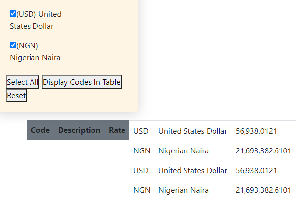

<h1 align="left">
<a href="https://shoreenb.github.io/bitcoin-basics/" target="_blank"></a>
</h1>

# Testing For Bitcoin Basics

[Main README.md](README.md)

[Visit the Bitcoin Basics page](https://shoreenb.github.io/bitcoin-basics/)

## Table Of Contents

1. [**Validation Services**](#valid)

2. [**Testing Client Stories**](#clientStories)

3. [**Manual Testing**](#manual)
- [**Tests For Desktop**](#desktop)
- [**Tests for Mobile Devices (Tablet and Phone)**](#devices)

4. [**Bugs**](#bugs)
- [**Solved**](#solved)

## Validation Services

The following validation services were used to check the validity of the website code.

- [W3C Markup Validation](https://validator.w3.org/) was used to validate HTML
- [W3C CSS Validation](https://jigsaw.w3.org/css-validator/) was used to validate CSS 

  <p>
      <a href="http://jigsaw.w3.org/css-validator/check/referer">
          
      </a>
  </p>
  <p>
  <a href="http://jigsaw.w3.org/css-validator/check/referer">
      
      </a>
  </p>

- [JSHint ](https://jshint.com/) was used to validate JavaScript

## Testing Client Stories

This section goes through each user story in the UX section of the README.md

As a newcomer to Bitcoin, with little to no technical knowledge, I want:

1. A clear guide with the key information I need to understand what Bitcoin is.
   - The 'Get Started' section contains the accordion feature which displays the key information any newcomer to Bitcoin will need to know.
   - Using an accordion allows one section at a time to be displayed so the visitor can clearly see the information displayed that is only for that particular topic.

2. Clear navigation to easily maneuver through the site.
   - The landing page is dedicated to navigation so the visitor can choose where they would like to go on the site and a beginner can go straight to the 'Get Started' guide.
   - The navigation bar is clearly displayed at the top of every page(except the landing page) and the page the visitor is currently on is highlighted.
   - Hovering over the controls highlights it so that the visitor can clearly see that it is a link.
   - The pagination buttons enable visitors to easily move to the next page or go back to the previous page so they don't have to return to the top of the page to the navigation bar every time.

3. The ability to compare the value of Bitcoin to various fiat currencies.
   - The Market Rates section allows the visitor to select all available currencies they would like to compare or to see the individual currency they would like to know the current price of in Bitcoin.

4. To see the current price of Bitcoin.
   - Selecting a currency in the Market Rates section allows the visitor to see the current price in Bitcoin, however, as mentioned in the 'Features Left To Implement' section of the README.md a more accessible feature would be to have the current price of Bitcoin displayed at the top of each page.

5. To be able to see the latest news to give context about Bitcoin.
   - The News section uses the [Messari.io API](https://messari.io/) to list the latest news articles for Bitcoin.

6. To have the ability to send the questions I have about Bitcoin.
   - The Contact Us section contains a form with a message section that allows visitors to write any questions or give feedback.
   - The form requires validation and a modal which alerts the visitor whether the form has successfully been sent or not.

As someone who has more knowledge about Bitcoin, I want:

1. The ability to go directly to the information that I require about the current price of Bitcoin.
   - The landing page allows the visitor to go directly to any section if they want to bypass the beginners guide.
   - The 'Buy Bitcoin' button allows the visitor to go directly to an exchange if they want to purchase Bitcoin

2. Information on further/ more advanced information on Bitcoin.
   - The Beginners guide contains a section on further reading for those who want more in-depth knowledge of Bitcoin
   - The Contact Us section also allow visitors to ask questions if they want further information.

3. A resource that I can direct new enquirers about Bitcoin to.
   - Bitcoin Basics is a very simple, clear site that will give any newcomer all the information the need to understand what Bitcoin is and what steps they need to take to buy, sell and store it.

4. To see the latest developments in Bitcoin.
   - Using the [Messari.io API](https://messari.io/) means that people who are very knowledgeable about Bitcoin will get very well sourced articles on Bitcoin, with detail and analytical information if that is required.
   - The Charts section provides a visual way to see the way Bitcoin has been trending over the last month and it's current price.

5. The ability to provide feedback about further improvements that can be made on the site to meet needs as an invested Bitcoin follower.
   - The Contact Us page allows a visitor to provide feedback on the site so that they can suggest potential improvements/ new features that will making their experience of using the site better.

## Manual Testing

This section is a detailed account of all the manual testing that has been done to confirm all the areas of the site work as expected.

### Tests For Desktop

The following steps were repeated using Chrome, Firefox and Internet Explorer and on two different screen sizes:

#### All Pages:

- Clicked on the logo to confirm it goes back to the home page
- Confirmed that the navbar links (apart from the link for the current page - the active link) changed colour when hovered over
- Checked that clicking on each navigation link leads to the correct page
- Checked that the background colour changes when hovering over the footer social links
- Checked that each social icon opens in a new page when clicked

#### Individual Pages:

1. Home Page

   - Opened the site in the selected browser to verify that the landing page loads
   - Confirmed that the placement of the logo, title, text, buttons and footer are all central
   - Checked that the buttons are not covering the footer
   - Clicked each of the buttons to make sure they led to the correct page
   - Checked that the button background colour and text changes when hovering over the buttons

2. Get Started

   - Confirmed the Get Started link on the navbar is  highlighted as active
   - Confirmed the bitcoin image is visible

     2.1 Accordion

     - Checked each of the titles drop down and show the information when clicked, then hide the information when clicked again
     - Checked the embedded hyperlinks worked
     - Clicked each of the book images to check that they open in a new tab

   - Checked that the 'Back' pagination button led back to the 'Home' page and 'Market Rates' pagination button goes to the Market Rates page when clicked

3. Market Rates

   3.1 Checkboxes

   - Checked that each individual checkbox is checked when selected
   - Checked that the 'Select All', 'Display Codes In Table' and 'Reset' buttons all change background colour when hovered over
   - Checked that the 'Select All' button selects all the checkboxes
   - Checked that the 'Reset' button unchecks all the selected checkboxes
   - Checked that selecting a few checkboxes and then clicking 'Reset' clears the checkboxes

   3.2 Display Table

   - Confirmed that individually selecting all the checkboxes and then clicking the 'Display Codes In Table' button, displays all the codes in the table below
   - Confirmed that clicking 'Reset' clears the table
   - Confirmed that clicking 'Select All' and then 'Display Codes In Table' displays all the codes in the table below and then 'Reset' clears it
- Checked that the 'Back' pagination button led back to the 'Get Started' page and 'Charts' pagination button goes to the Charts page when clicked

4. Charts

   - Checked that the chart 'Bitcoin Rates  For The Previous 31 Days' loads when entering the page
   - Checked that the chart fills the width of the screen
   - Checked that the labels of for the X and Y axis are visible 
   - Checked that the correct data is being displayed i.e. the price of Bitcoin for the previous month up until yesterday
   - Checked the embedded API link in the text below the graph works
   - Checked that the 'Back' pagination button led back to the 'Market Rates' page and 'Latest News' pagination button goes to the Latest News page when clicked

5. Latest News

   - Confirmed that the image loads when entering the page
   - Confirmed that the list of news titles appear 
   - Checked that when each title is clicked it opens a new tab with the full article
   - Checked that the 'Back' pagination button led back to the 'Charts' page and 'Contact Us' pagination button goes to the Contact Us page when clicked

6. Contact Us

   - Checked that the Bitcoin Image loads when entering the page
   - Checked that the Email Form is visible
   - Checked that when a name was added and then submitted,  tooltips provided feedback that the name and message fields have not been completed and an error modal appears advising that the message did not send.
   - Checked that when a name and correct email address was added and then submitted, tooltips provided feedback that the message field has not been completed and an error modal appears advising that the message did not send.
   - Checked that when only a correct email address was added and then submitted, tooltips provided feedback that the name and message fields have not been completed and an error modal appears advising that the message did not send.
   - Checked that when a name and incorrect email was added and then submitted, tooltips provided feedback that the email field has been completed incorrectly and the message field has not been completed and an error modal appears advising that the message did not send.
   - Checked that when a name and message was added and then submitted, tooltips provided feedback that email field has not been completed and an error modal appears advising that the message did not send.
   - Checked that when an incorrect email and message was added and then submitted, tooltips provided feedback that the email field has been completed incorrectly and an error modal appears advising that the message did not send.
   - Checked that when all the fields have been completed correctly, tooltips provided feedback that all fields have been completed correctly and a modal appears advising that the message was sent.
   - Checked that the 'Send' button changes background and text colour when hovered over.
   - Checked that the 'Back' pagination button led back to the 'Latest News' page when clicked.

7. Buy Bitcoin

   - Checked that the 'Buy Bitcoin' link works and opens a new tab when clicked.

8. Footer

   - Confirmed that the footer is in the correct place, at the bottom.

### Mobile Devices (Tablet and Phone)

The following steps were repeated on physical devices available to the developer: Oppo X2 Lite, Motorola G8, Samsung and 2 different sized tablets, as well as all the simulated devices and responsive options on the Chrome Developer Tools:

#### All Pages:

- Checked the size and placement of the logo on all device screen sizes
- Confirmed that font size is legible on all screen sizes, especially small and medium screens
- Checked that the navbar responsively collapses behind a button on small and medium screens
- Checked that the content at least fills the height of the screen with the footer at the bottom
- Checked that buttons and fields are large enough to click but still fit on the screen comfortably

#### Individual Pages:

1. Home Page
- Checked that everything is displayed centrally and fits within the height of the screen.
- Checked that the buttons are not cut off, squashed or overlapping the footer especially on screens with a width below 992px 

2. Get Started
- Checked that the accordion fills the width of the screen (up to min-width 768px) or the accordion and image are displayed in 2 columns.
- Checked that the pagination buttons are stacked and do not overlap the image or footer

3. Market Rates
- Checked that the titles, checkboxes, table and buttons are displayed centrally
- Checked that the pagination buttons are stacked and do not overlap the table or footer

4. Charts
- Checked that the chart fills the width of the screen
- Checked that the pagination buttons are stacked and do not overlap the chart or footer

5. News
- Checked that the title, text and image are central
- Checked that the news article titles fit within the width of the page
- Checked that the pagination buttons are stacked and do not overlap the article titles or footer

6. Contact Us
- Checked that the title, text and form are central
- Checked that the form fits within the width of the page
- Checked that the 'Back' button does not overlap the 'Send' button or footer

## Bugs

### Solved



1. **The 'Reset' button did not clear the last checked options so it added the new options to the table underneath the last ones**
    - Fix:
    
    Added `checkedCurrencies = [];` into the function calling the API

    Then added a new function, which was called within each of the buttons:
    ```
    function resetTable() {
    document.getElementById("coinPriceTable").innerHTML = "";
    }
    ```
    This ensured that the table was cleared before the button 'Display Codes In Table' was clicked

2. **The news article titles had the blue underline text decoration**

    The style for the news articles coming from the [Messari API](https://messari.io) would not be altered using CSS. 
    - Fix:
    Added `a.style.color = 'black';` into the news.js JavaScript function to change the text colour from blue to black.